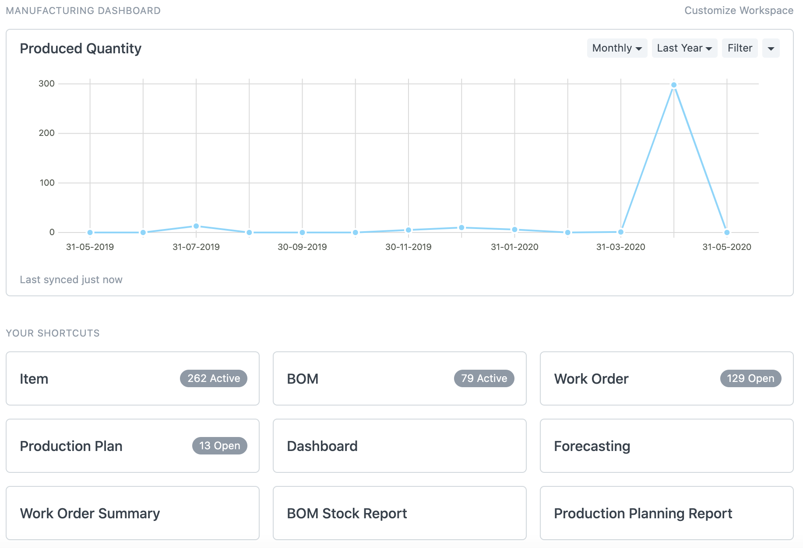

The Manufacturing module in CERP covers all necessary features a Manufacturing business would need. There are options to take a Work Order, enter stock of items, create a Production Plan, create a Downtime Entry, manage the Bill of Materials for Finished Goods / Template Items, generate reports, and more.

Different types of manufacturing like make to stock, make to order, and engineer to order can be managed in the CERP Manufacturing module.

## 1. Topics

### 1.1 Basic and Setup

1. [Onboarding](/docs/industryModule/manufact/onboard)
1. [Manufacturing Settings](/docs/industryModule/manufact/manuSett)
1. [Manufacturing Dashboard](/docs/industryModule/manufact/manuDash)

### 1.2 Bill of Materials

1. [Bill Of Materials](/docs/industryModule/manufact/billMate)
1. [Operation](/docs/industryModule/manufact/op)
1. [Workstation](/docs/industryModule/manufact/workstation)
1. [Routing](/docs/industryModule/manufact/routing)

### 1.3 Production and Material Planning

1. [Work Order](/docs/industryModule/manufact/workOrder)
1. [Job Card](/docs/industryModule/manufact/jobCard)
1. [Production Plan](/docs/industryModule/manufact/productPlan)
1. [Downtime Entry](/docs/industryModule/manufact/downtimeEnt)

### 1.4 Advanced

1. [Item Alternative](/docs/industryModule/manufact/itemAlt)
1. [Subcontracting](/docs/industryModule/manufact/subcon)
1. [BOM Update Tool](/docs/industryModule/manufact/bomUp)
1. [BOM Comparison Tool](/docs/industryModule/manufact/bomComp)

## 2. Manufacturing Reports

### 2.1 Planning

1. [Demand Driven Forecasting](/docs/industryModule/manufact/demandDriv)
1. [Production Planning Report](/docs/industryModule/manufact/productPlanRep)

### 2.2 Work Order, Quality Inspection & Job Card

1. [Work Order Summary](/docs/industryModule/manufact/workOrderSum)
1. [Consumed Materials in Production](/docs/industryModule/manufact/consMat)
1. [Job Card Summary](/docs/industryModule/manufact/jobCardSum)
1. [Quality Inspction Summary](/docs/industryModule/manufact/qualityInsp)
1. [Production Analytics](/docs/industryModule/manufact/productAna)

### 2.3 BOM, Operations, and Maintenance

1. [BOM Search](/docs/industryModule/manufact/bomSear)
1. [BOM Stock Report](/docs/industryModule/manufact/bomStock)
1. [BOM Operations Time](/docs/industryModule/manufact/bomOp)
1. [Downtime Analysis](/docs/industryModule/manufact/downAna)

## 3. Articles

### 3.1 Production

1. Capacity Planning
1. Open Work Orders
1. Scrap Management

### 3.2 Bill of Materials

1. Managing Multi-level BOM
1. Valuation Based On Field In BOM
1. BOM Costing in Different Currency

### 3.3 Others

1. Material Consumption
1. Customer Provided Items
1. How to change Dashboard in Manufacturing Desk
1. Run MRP on Parent Warehouse in Production Plan

## 4. Videos

1. Bill of Materials
1. Work Order
1. CERP for Manufacturers (Make to Order)
1. CERP for Manufacturers (Engineer to Order)
1. CERP for Manufacturers
